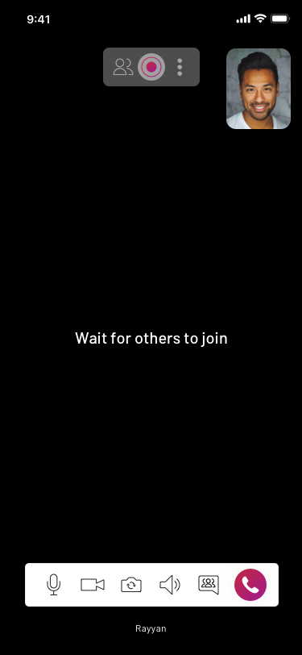
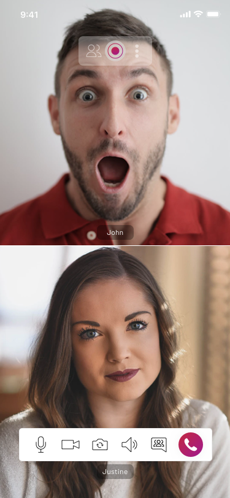
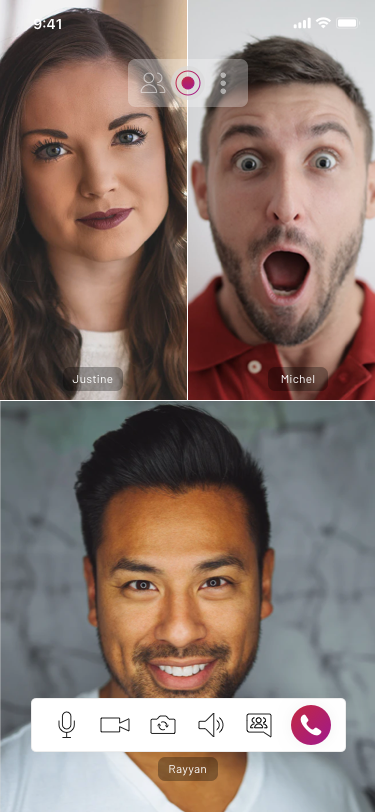
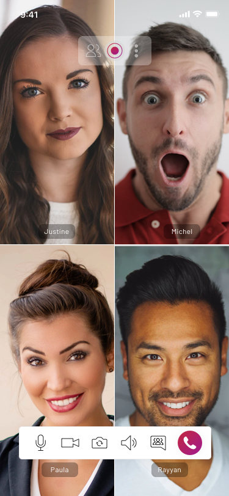
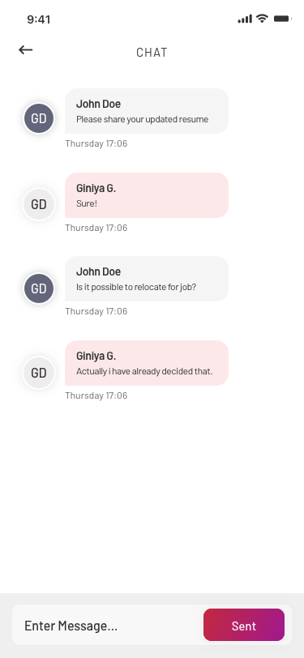
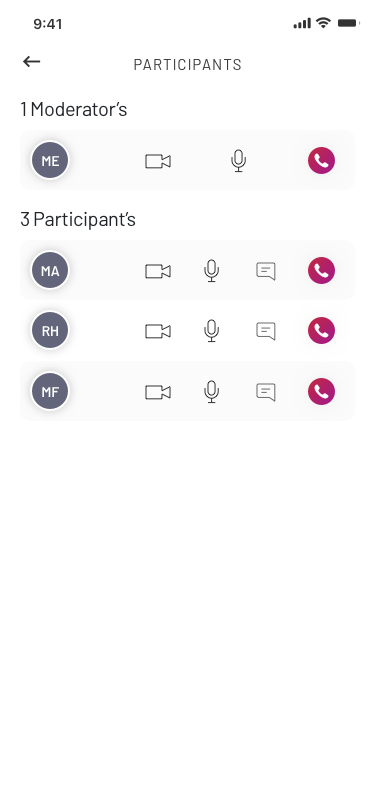

# EnableX Video Calling Android App with UIKit: Features, Setup, and Customization Guide

Discover the EnableX Video Calling Android app equipped with the powerful UIKit. 

This sample video calling application harnesses the robust EnableX infrastructure, APIs, and Toolkit to offer Android developers an immersive experience with real-time video and audio capabilities. 

With this sample app, you can effortlessly: 

    Create Virtual Rooms using the REST video API. 

    Obtain the essential Room Credentials (Room ID) for secure access. 

    Seamlessly Join Virtual Rooms as either a moderator or participant. 

Experience a wide array of features designed for both Participants and Moderators: 

For Participants and Moderators: 

    Mute Self-Audio: Take control of your audio input. 

    Mute Self-Video: Manage your video feed at your convenience. 

    Switch Camera: Toggle between front and rear cameras. 

    Switch Audio Device: Easily switch between different audio devices. 

    Group and Private Chat: Engage in interactive chat sessions. 

Additional capabilities for Participants: 

    Participant List: View and manage participants in the call. 

    Switch Layout: Customize the call layout to your preference. 

    Disconnect Call: End the call when needed. 

    Raise Hand to Join the Floor (only available in webinar mode): Indicate your desire to participate actively. 

Exclusive features for Moderators: 

    Record Session: Capture valuable moments during the session. 

    Mute Room: Control the audio within the virtual room. 

    Mute Participant-Audio: Manage audio output for specific participants. 

    Mute Participant-Video: Control video visibility for participants. 

    Drop Participant from room: Remove unwanted participants. 

    Allow/Deny Participant’s Raised Hand Request (only available in webinar mode): Regulate participant interactions. 

    Revoke Allowed Raised Hand Request (only available in webinar mode): Manage participant engagement. 

For more detailed information, please visit our comprehensive Developer Center at https://developer.enablex.io/docs/guides/ui-kit-guide/android-ui-kit-guide/index/. Explore the capabilities of the EnableX Video Calling Android app with UIKit and enhance your real-time communication experiences. 
## 1. Get started

### 1.1 Prerequisites

#### 1.1.1 App ID and App Key 

You would need API Credentials to access EnableX platform. To do that, simply create an account with us. It’s absolutely free!

* Create an account with EnableX - https://portal.enablex.io/cpaas/trial-sign-up/
* Create your Project
* Get your App ID and App Key delivered to your email

#### 1.1.2 Requirement

* Android Studio
* Language: Either Kotlin or java
  

#### 1.1.3 Sample Android Client 

* Clone or download this Repository : https://github.com/EnableX/Audio-Video-Chat-Application-Sample-with--UIKit-for-IOS.git 

#### 1.1.4 Application Server

An Application Server is required for your Android App to communicate with EnableX. We have different variants of Application Server Sample Code. Pick the one in your preferred language and follow instructions given in README.md file of respective Repository.

* NodeJS: https://github.com/EnableX/Video-Conferencing-Open-Source-Web-Application-Sample.git 
* PHP: https://github.com/EnableX/Group-Video-Call-Conferencing-Sample-Application-in-PHP

Note the following:
•	You need to use App ID and App Key to run this Service.
•	Your Android Client EndPoint needs to connect to this Service to create Virtual Room and Create Token to join the session.
•	Application Server is created using [EnableX Server API](https://developer.enablex.io/docs/references/apis/video-api/index/) while Rest API Service helps in provisioning, session access and post-session reporting.

If you would like to test the quality of EnableX video call before setting up your own application server,  you can run the test on our pre-configured environment. Refer to point 2 for more details on this.

### 1.2 Configure Android Client 

* Open the App
* Go to RetrofitHelper.kt, it's reads: 

``` 
 /* To try the App with Enablex Hosted Service you need to set the kTry = true
    When you setup your own Application Service, set kTry = false */
    
    let kTry = true

 /* Your Web Service Host URL. Keet the defined host when kTry = true */

  private const val baseUrl:String = "https://demo.enablex.io/"

     
 /* Your Application Credential required to try with EnableX Hosted Service
    When you setup your own Application Service, remove these */
    
     //
    private const val  kAppId:String = "AppId";
    private const val  kAppkey:String = "AppKey";

 
 ```

### 1.3 Test

#### 1.3.1 Open the App

* Open the App in your Device. You get a form to enter Name, Room ID and Role (Moderator or Participant). 
* If you don't have a Room ID, create a Room by clicking the "Create Room" button.
* Enter the Room ID in the Form to connect to the Virtual Room to carry out an RTC Session either as a Moderator or a Participant.
* Share Room ID with others to join the Virtual Room with you.

Note: 
* This Sample Application created a Virtual Room with limited Participant and 1 Moderator only. 
* In case of emulator/simulator your local stream will not create. It will create only on real device.

## 2. Testing Environment

If you would like to test the quality of EnableX video call before setting up your own Application server,  you can run the test on our [pre-configured environment.](https://try.enablex.io/)
In this environment, you will only be able to:

* Conduct a single session with a total durations of not more than 15 minutes
* Host a multiparty call with no more than 6 participants 

> More information on Testing Environment: https://developer.enablex.io/video/sample-code/#demo-app-server

Once you have tested it, it is important that you set up your own Application Server to continue building a one to one or multiparty Android video calling app. Refer to section 1.1.4 on how to set up the Application Server. 
  
## 3. Android UIKit

This Sample Application uses EnableX Android UIKit to communicate with EnableX Servers to initiate, manage Real-Time Communications and create a beautify & customized Audio/Video call UI. Please update your Application with latest version of EnableX Android UIKit as and when a new release is available. 

 

```
    Only one user join
```



```
    Two users join
```



```
    Multiple users join
```





```
    Chat page
```



```
    lis of avaliable Participants in session
```


# Here to beautify & customized the UI as follow

## Customize Bottom Bar

    
    val setting = EnxSetting.getInstance(this) 

// Enumerated values to use for BottomOption are
// AUDIO, VIDEO, SWITCH_CAMERA, SWITCH_AUDIO, GROUP_CHAT, DISCONNECT 

val audioButton = EnxButton(this,EnxSetting.BottomOption.AUDIO.tag) 
audioButton.setImage(R.drawable.audio_on,R.drawable.audio_off) 

setting.configureBottomOptionList(listOf<EnxButton>( audioButton, disconnectButton)) 


## Customize Top Bar

val setting = EnxSetting.getInstance(this)

// Enumerated values to use for TopOption are
// USER_LIST, MENU, REQUEST_FLOOR 

val userList = EnxButton(this,EnxSetting.TopOption.USER_LIST.tag) 
userList.setImage(R.drawable.participant_icon) 


 
setting.configureTopOptionList(listOf<EnxButton>(menu,userList)) 

# For more check this below document
* Documentation: https://developer.enablex.io/docs/guides/ui-kit-guide/android-ui-kit-guide/index/
* Download: https://developer.enablex.io/docs/guides/ui-kit-guide/android-ui-kit-guide/index/


## 4. Support

EnableX provides a library of Documentations, How-to Guides and Sample Codes to help software developers get started. 

> Go to https://developer.enablex.io/. 

You may also write to us for additional support at support@enablex.io.   
